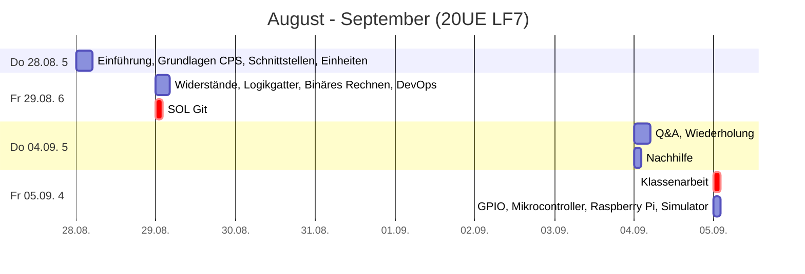
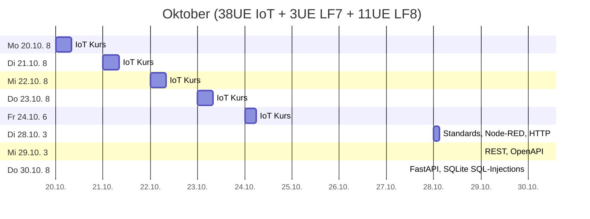
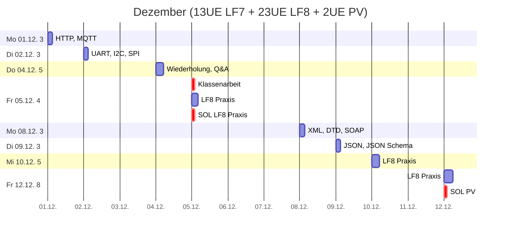
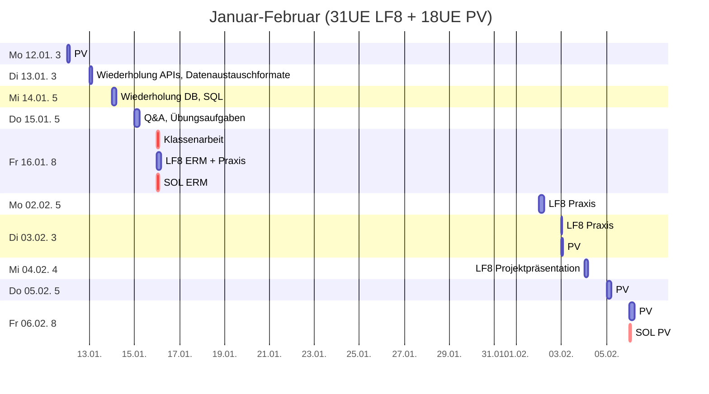
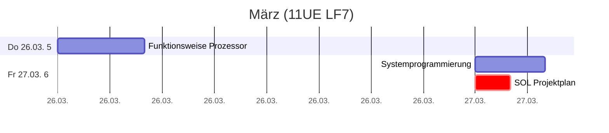
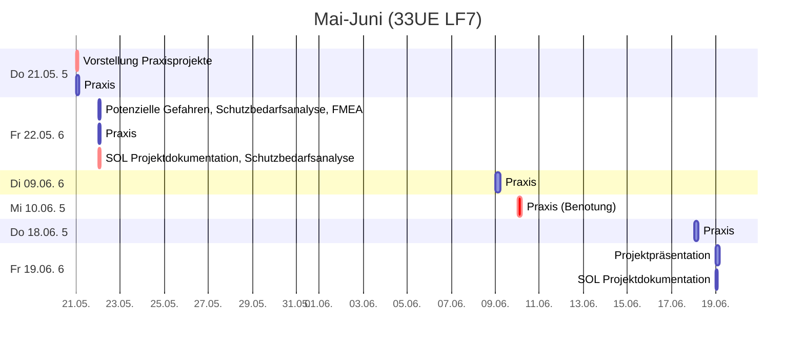

# Plan

## Zeitplan

## Leistungskontrollen

* Soll Notendichte: 7 
* Minimum Klassenarbeiten (>45min, doppelte Wertung): 2
* Sonstige Noten: >=3

> * **1. Klassenarbeit 05.09.** ~90min (einseitig beschrifteter A4 Notizzettel + 1 einfacher Taschenrechner ohne Binärberechnungen)
>   * [Grundlagen CPS](grundlagen.md), [Begriffe](buzzwords.md): CPS, System, Anwendungsfelder, Technologien
>     * [Industrie 4.0](industrie40.md)
>     * [Schnittstellen](schnittstellen.md): HCI, M2M, CPS, Sensor, Aktuator
>   * [Elektrische Einheiten](einheiten.md) 
>   * [Widerstände](./resistor.md)
>     * Berechnung von (Vor-)Widerständen
>     * Pullup-/Pulldown-Wiederstände
>   * [Logische Verknüpfungen](./gatter.md) (Not, And, Or, XOr)
>     * Wahrheitswertetabelle
>     * Schaltung mit einfachen (Um-)Schaltern
>   * [Rechnen mit Binärzahlen, Zweierpotenzen](binary.md)
>   * [Grundlagen Git](./git.md)
>     * [DevOps](devops.md)

> * **2. Klassenarbeit 27.03.** (1.+2. UE) ~90min (einseitig beschrifteter A4 Notizzettel)
>   * Auswahl [Hardwareplatformen und Programmiersprachen](./microcontroller/beispiele.md)
>   * [Rechnernetze / Topologien](rechnernetze.md)
>   * [OSI-Modell](osi.md) (insbesondere Physical Layer und anwendungsorientierte Protokolle)
>   * [HTTP](http.md), [MQTT](mqtt.md)
>   * [UART](bituebertragung.md#uart), [SPI](rechnernetze.md#spi), [I²C](rechnernetze.md#i²c)
>   * Grundlagen Programmierung (Variablen, While, If/Else, Funktionen)
>     * Siehe Programmierbeispiele [Pi](pi.md), [I²C-Beispiel (main.py)](rechnernetze.md#i²c)

Programmier-Übungsaufgaben:
* Blink [Pi Pico](https://wokwi.com/projects/300504213470839309), [ESP32](https://wokwi.com/projects/359801682833812481)
* [Ampel](https://wokwi.com/projects/432915684639002625)
* [Buzzer](https://wokwi.com/projects/432915379839949825)
* [Button](https://wokwi.com/projects/432915323107785729)
* [7-Segment + Schalter](https://wokwi.com/projects/300210834979684872)

> * **Mündliche Note 21.05.**
>   * Vorstellung Projektplan (SOL vom 27.03.)
>   * Bisherige Mitarbeit

> * **Bewertung Praxisprojekt** am **10.06.**
>   * **Note für fachliche Leistung**
>   * **Note für Mitarbeit**
> * Projektpräsentation 19.06. (nach Notenschluss)
