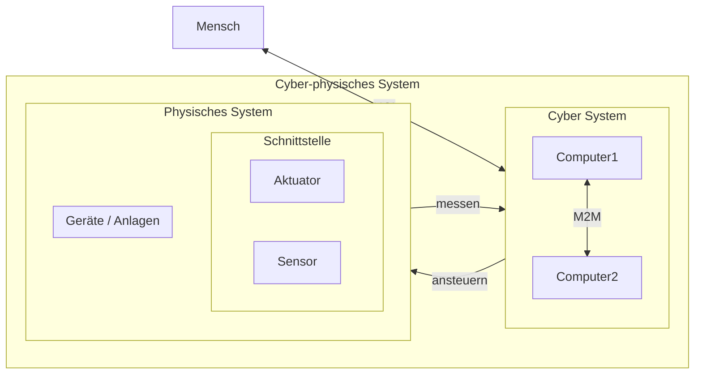

# Praxiseinstieg

### Relevanz für Ausbildung und Berufsleben

> **❓💬** Vergleichen Sie, welche der Lernfelder von LF7-LF9 besonders relevant für<br/> **Anwendungsentwickler** bzw. **Systemintegratoren** sind.

```
LF 7: Cyber-physische Systeme ergänzen
LF 8: Daten systemübergreifend bereitstellen
LF 9: Netzwerke und Dienste bereitstellen
```

=> [DevOps](devops.md)

### Komponenten von CPS


> **❓** Beurteilen Sie, welche Komponente von CPS ist für uns besonders relevant ist.



> **❓💡** Benennen Sie Bauteile, die als Kernkomponenten in CPS / IoT-Geräten verbaut werden.


### heutige Lernziele

* <u>**Mikrocontroller**</u> kennen lernen und von **Einplatinencomputer** unterscheiden
  * Geeignete Hardware für CPS/IoT-Projekte auswählen
* Verstehen was ein **Pinout** ist und was die damit verbundenen Herausforderungen in der Praxis sein können (=> [HAL](https://de.wikipedia.org/wiki/Hardwareabstraktionsschicht))
* Plattformen und **Frameworks** für IoT-Anwendungen kennen lernen
  * **Programmiersprache** für Projekte auswählen

#### mittelfristige [Ziele](ziele.md)

* selbstständige **Praxisfähigkeiten** (weiter-)entwickeln
* **technischen Dokumentation** lesen, **verstehen**, schreiben
* **Komplexität** begreifen und kontrollieren
* effizient **Debuggen**
* **Sicherheit** einschätzen und im erforderlichen Maß umsetzen

=> Systeme designen, entwickeln, ergänzen, integrieren, …
