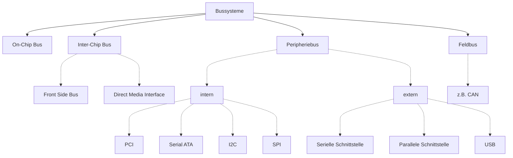

# Rechnernetze

## [Topologien](https://de.wikipedia.org/wiki/Topologie_(Rechnernetz))

> Welche Topologien kennt ihr? Wo finden sie Anwendung?

> Welche Vor- und Nachteile haben verschiedene Topologien?

## Bussysteme

> Für welche Einsatzzwecke sind Bussysteme attraktiv? Warum?

### [SPI](https://de.wikipedia.org/wiki/Serial_Peripheral_Interface)
(**S**erial **P**eripheral **I**nterface)

* 4 Signalleitungen
  * SCLK = Serial Clock
  * MOSI / PICO = Master Out / Slave In bzw. Peripheral In / Controller Out
  * MISO / POCI = Master In / Slave Out bzw. Peripheral Out / Controller In
  * SS / CS = Slave Select bzw. Chip Select

### [I²C](https://de.wikipedia.org/wiki/I%C2%B2C)

* Master-Slave-Bus
* zwei Signalleitungen
  * SCL = Serial Clock
  * SDA = Serial Data

* 7-bit Adressraum

> Beispiel: [I2C-LCD-Display](https://wokwi.com/projects/359400194112248833)

#### [Anwendungsfälle](pi.md#serielle-protokolle)
