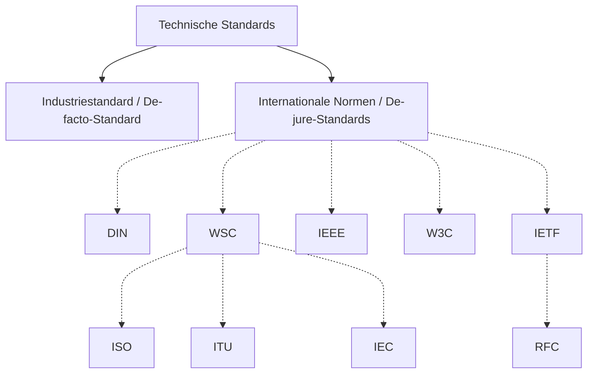

# Standards / Normen

> Wofür werden Standards benötigt?

> Welche Standards und Standardisierungsgremien kennen Sie?

## [Normen können auch Spaß machen…](https://de.wikipedia.org/wiki/Request_for_Comments#Realisierte_Aprilscherze)

<iframe width="560" height="315" src="https://www.youtube.com/embed/_hnOCUkbix0?si=3MwiH4yiCuucQhki" title="YouTube video player" frameborder="0" allow="accelerometer; autoplay; clipboard-write; encrypted-media; gyroscope; picture-in-picture; web-share" referrerpolicy="strict-origin-when-cross-origin" allowfullscreen></iframe>

### …und Spaß mit nicht normierten Produkten:

[Category:Forbidden electrical items](https://commons.wikimedia.org/wiki/Category:Forbidden_electrical_items)

[Gardena auf Drehstrom](http://duckduckgo.com/?q=drehstrom+gardena&ia=images&iax=images)

